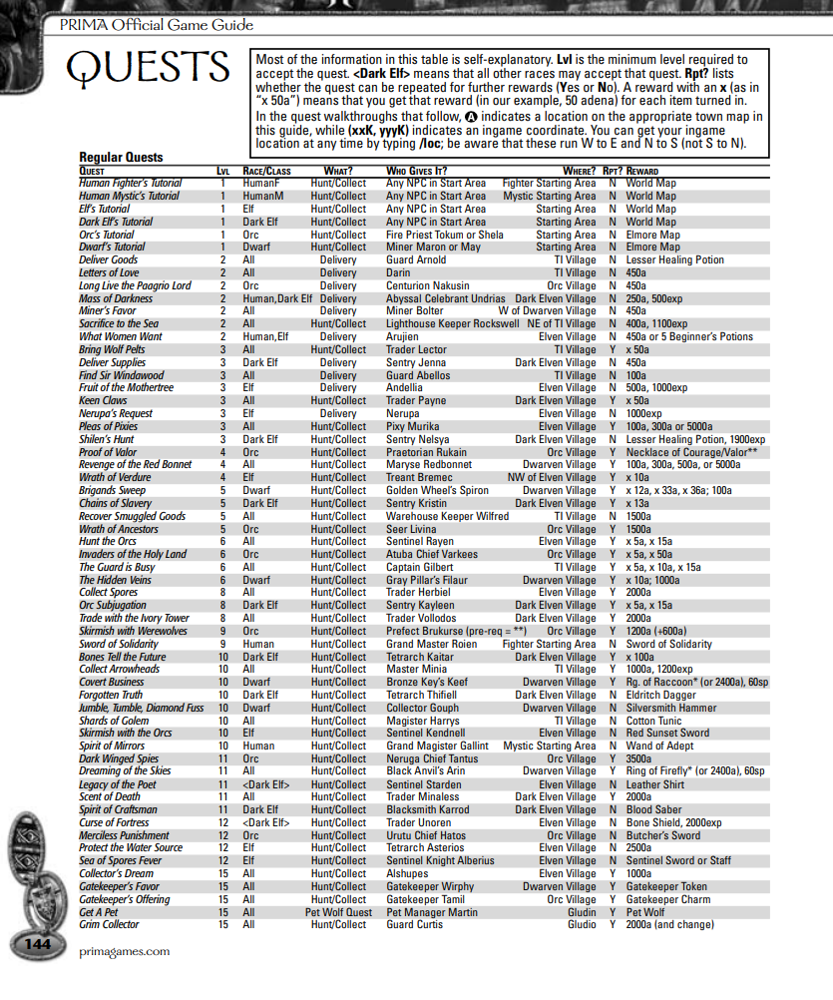
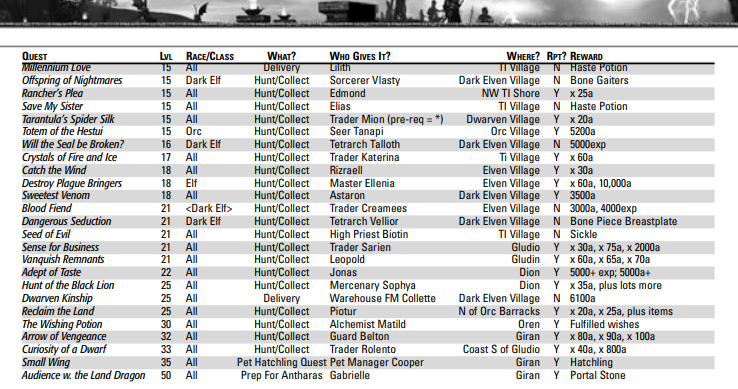

# List of resources for legacy

Big thanks to the Reborn Legacy channel community for their help with resources and information, specially ArnasPanic, NecroVer.VII, Ordinary and many others, keep up the hype for legacy!

# Stream

**The next official stream is happening 23 August 2026.**

Official streams:

<a href="https://www.twitch.tv/norekien" target="_blank">Twitch</a>

# Chronicle 1

## List of repeatable quests

## Prima Guide

This guide mostly contains information about everything that happened during C1, from classes, to quests and rewards and much more, feel free to download it an take a look!

[Download PDF](../resources/legacy/L2-PrimaGuide.pdf)

# Videos

For the videos below, they are all in Russian since I did not find many resources for C1 in English, feel free to use autotranslate for audio in Youtube to English or any other language.

## General overview

<a href="https://www.youtube.com/watch?v=ek5ptEa-t6A" target="_blank">General overview of classes</a>

## DDs and Tanks

<a href="https://www.youtube.com/watch?v=ZQqkTmFrVNI" target="_blank">Tanks and rogues</a>

<a href="https://www.youtube.com/watch?v=5_ldcGdNqhQ" target="_blank">Mages and summoners</a>

## Buffers and Healers

<a href="https://www.youtube.com/watch?v=nUVck9z1avE" target="_blank">PP/SE/WC/OL</a>

<a href="https://www.youtube.com/watch?v=odVT_zh4HD4" target="_blank">SWS/BD/EE/BP</a>

